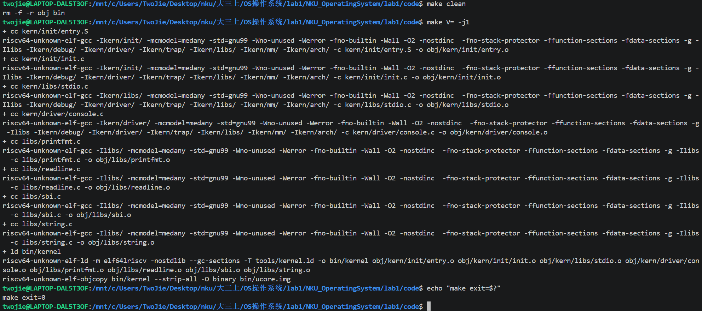
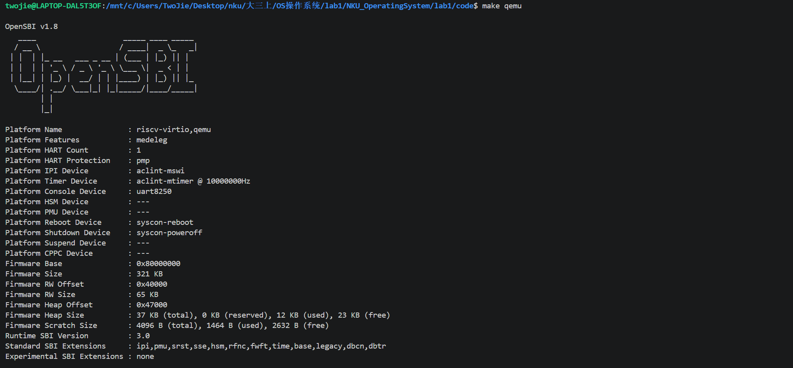
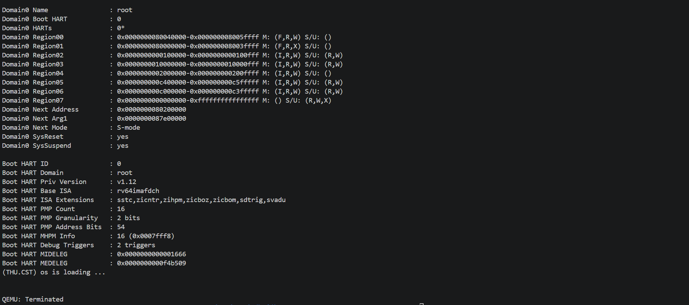
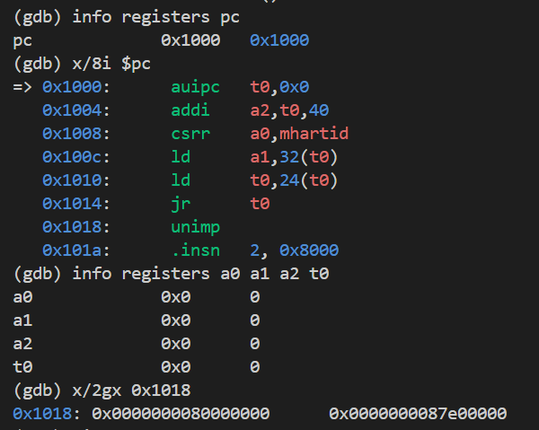
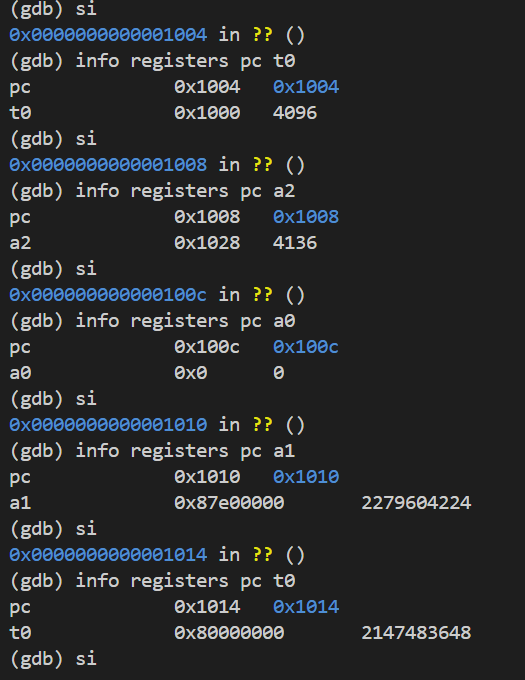
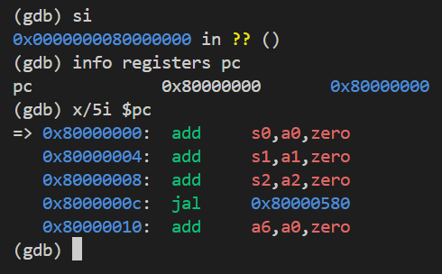
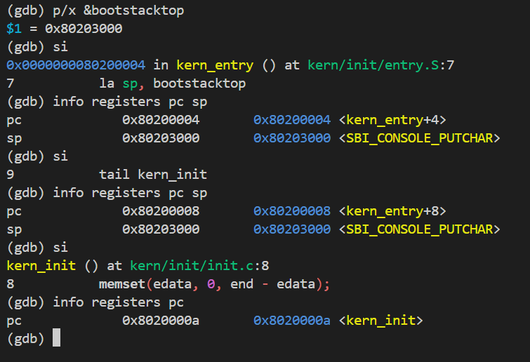
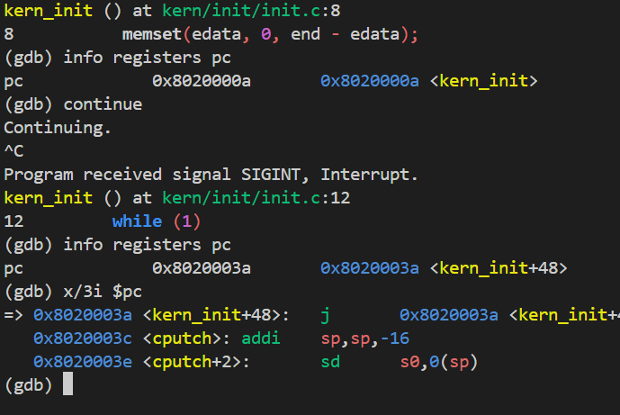

# 操作系统实验报告

## 实验基本信息

| 项目 | 内容 |
|------|------|
| **实验名称** | Lab 1: 最小可执行内核 |
| **小组成员** | 2411268-黄泽恺、2412677-郑奕杰、2412414-黄子恒 |
| **完成日期** | 2026-10-11 |

### 小组分工

练习分工

| 成员 | 负责的练习/模块 |
|------|----------------|
| 2411268-黄泽恺 | 练习 1 理解内核启动中的程序入口操作 |
| 2412414-黄子恒 | 练习 2 使用GDB验证启动流程 |
| 2412677-郑奕杰 | 编译运行与输出模块分析 |

实验报告分工

| 成员 | 负责的部分 |
|------|----------------|
| 2411268-黄泽恺 | 实验目的、启动与内存布局的模块分析、练习 1、实验报告整合 |
| 2412414-黄子恒 | 启动调试相关命令与验证、练习 2 |
| 2412677-郑奕杰 | 编译运行与输出模块分析、实验报告第五部分 |

小组成员共同填写各自的实验环境，阅读实验手册进行逻辑梳理，共同交流完整实验总结与收获。

---

## 一、实验目的

<!-- 说明本次实验的主要目标和预期成果 -->

本实验的主要目的是：

1. 理解 RISC-V 系统从复位、OpenSBI 初始化到内核入口执行的启动流程，掌握入口汇编设置内核栈并跳转至 C 初始化函数的作用
2. 理解链接脚本与内核内存布局，掌握交叉编译、链接和镜像生成流程，并通过 QEMU 运行最小可执行内核，了解基于 SBI 的格式化输出机制
3. 掌握 QEMU 与 GDB 联合调试的方法，通过断点、单步执行及寄存器观察，验证从复位地址到内核入口的执行过程

---

## 二、实验环境

WSL: Ubuntu-22.04

| 成员 | AI 编程工具 | 底层模型 | 备注 |
|------|------------|---------|------|
| 2411268-黄泽恺 | ChatGPT Work | GPT-6.1 Sol | - |
| 2412414-黄子恒 | ChatGPT Work | GPT-6.1 Sol | - |
| 2412677-郑奕杰 | ChatGPT Work | GPT-6.1 Sol | - |

**说明：**
- **AI 编程工具**：指具体使用的终端工具、编辑器插件、桌面应用或浏览器界面
- **底层模型**：指该工具使用的大语言模型及版本

---

## 三、实验整体逻辑分析

### 3.1 本章节的逻辑主线

本章节围绕“建立并验证一个最小可执行内核”展开，依次解决内核放在哪里、从哪里开始执行、如何建立运行环境，以及如何输出启动信息的问题。

QEMU 启动时，将 OpenSBI 和内核镜像分别加载到物理地址 `0x80000000` 和 `0x80200000`。CPU 从复位地址 `0x1000` 执行复位代码，随后进入 OpenSBI。OpenSBI 在 M 模式下完成运行环境初始化，再将控制权交给 S 模式下的内核入口 `kern_entry`。入口汇编设置内核栈指针，并跳转到 C 语言初始化函数 `kern_init()`；该函数清零 BSS 区域，通过 `cprintf()` 和 SBI 服务输出启动信息，最后进入无限循环。

为使这一过程正确衔接，实验先通过链接脚本确定内核的地址布局，再建立栈和初始数据环境，随后实现输出功能，最后通过交叉编译、QEMU 运行及 GDB 调试验证启动链条。

```text
QEMU 加载 OpenSBI（0x80000000）与内核镜像（0x80200000）
                         ↓
CPU 从复位地址 0x1000 开始执行复位代码
                         ↓
进入 OpenSBI，在 M 模式下初始化运行环境
                         ↓
OpenSBI 将控制权交给 S 模式下的内核
                         ↓
执行内核入口 kern_entry（0x80200000）
                         ↓
la sp, bootstacktop：设置内核启动栈指针
                         ↓
tail kern_init：进入 C 语言初始化函数
                         ↓
memset(edata, 0, end - edata)：清零 BSS 区域
                         ↓
cprintf() 通过 SBI 服务输出启动信息
                         ↓
进入无限循环，维持最小内核运行
```

### 3.2 功能的逐步实现

1. 确定内核内存布局与入口地址

    `tools/kernel.ld` 使用 `ENTRY(kern_entry)` 指定入口符号，并将布局起始地址设为 `0x80200000`。链接器按照脚本安排代码和数据，依次组织 `.text`、`.rodata`、`.data`、`.sdata` 和 `.bss` 等段，分别存放指令、只读常量、已初始化的可写数据、小数据以及需要初始化为零的数据；其中，数据区域起始位置按 `0x1000` 字节进行页对齐。

    QEMU 将内核镜像加载到 `0x80200000`，OpenSBI 随后跳转到该地址，因此需要将 `kern_entry` 的入口代码安排在镜像开头。链接脚本通过 `ENTRY(kern_entry)` 指定入口符号，并安排代码和数据的位置，使编译时确定的地址与实际加载地址一致，为启动栈设置和 BSS 清零提供正确的地址。

2. 建立内核执行环境

    内核刚获得控制权时，需要先建立自己的栈，才能执行依赖函数调用约定的 C 代码。`kern/init/entry.S` 在 `.data` 段中通过 `.space KSTACKSIZE` 预留两页、共 8192 字节的启动栈，并按页对齐；`bootstack` 和 `bootstacktop` 分别标记栈空间的低地址起点与高地址边界。

    由于栈向低地址增长，`kern_entry` 首先执行 `la sp, bootstacktop`，将栈指针设为高地址边界，建立初始空栈；随后执行` tail kern_init`，将控制权交给 C 初始化函数，不建立返回汇编入口的路径。

    `kern_init()` 首先执行 `memset(edata, 0, end - edata)`。其中，`edata` 和 `end` 由链接脚本定义，分别标记已初始化数据区域的结束位置和 BSS 区域的结束位置。清零这一区间，使未显式初始化的全局变量和静态变量满足 C 语言的初始零值要求。完成栈设置和 BSS 初始化后，内核即可继续调用输出函数，最终进入无限循环。

3. 通过 SBI 实现格式化输出

    `kern_init()` 调用 `cprintf("%s\n\n", message)` 输出启动信息。`cprintf()` 将可变参数传给 `vcprintf()`，由 `vprintfmt()` 解析格式字符串，再通过 `cputch()`、`cons_putc()` 和 `sbi_console_putchar()` 逐字符输出。`sbi_call()` 将服务编号和参数写入寄存器，通过 `ecall` 请求 OpenSBI 完成控制台输出。内核没有宿主 Linux 的标准库和系统调用环境，因此需要自行实现格式化与字符输出接口。

4. 编译、运行并验证启动流程

    在 `lab1/code` 目录执行 `make`，使用 RISC-V 交叉编译器将 C 和汇编源码编译为目标文件，再依据 `tools/kernel.ld` 链接生成 ELF 内核 `bin/kernel`，通过 `objcopy` 转换为裸二进制镜像 `bin/ucore.img`。执行 `make qemu`，由 QEMU 加载 OpenSBI 和内核镜像，观察启动信息。通过 `make debug` 配合 GDB 的断点、单步执行和寄存器检查，验证复位入口、固件交接、栈设置及进入 `kern_init()` 的过程。

---

## 四、实验内容与实现

<!-- 
说明：本部分按照 exercises 文档中的练习顺序组织
每个功能模块或者练习中可能包含多项任务，请根据实际情况调整
-->

### 4.1 练习 1：理解内核启动中的程序入口操作

**负责人：** 2411268-黄泽恺

1. `la sp, bootstacktop` 的操作及目的

    `la` 是 RISC-V 的加载地址伪指令。该指令将符号 `bootstacktop` 对应的地址写入栈指针寄存器 `sp`，即：

    ```text
    sp ← bootstacktop 的地址
    ```

    `entry.S` 中通过 `.space KSTACKSIZE` 为启动栈预留空间，`bootstack` 表示这块空间的起始地址，`bootstacktop` 表示其高地址边界。由于栈从高地址向低地址增长，初始时将 `sp` 指向 `bootstacktop`，表示一个空栈。

    其目的是建立内核自己的启动栈，为执行 C 语言代码准备运行环境。后续函数调用需要利用栈保存返回地址、寄存器和部分局部变量，因此必须在进入 `kern_init()` 前设置有效的栈指针。

2. `tail kern_init` 的操作及目的

    `tail` 是 RISC-V 的尾调用伪指令，将程序控制权转移到 `kern_init`，使 CPU 开始执行该函数。不同的是，`tail` 并不会将当前跳转后的地址保存到返回地址寄存器 `ra`。

    其目的是将内核启动流程从汇编入口交给 C 语言编写的初始化函数。本实验中的 `kern_init()` 清零 BSS 区域、输出启动信息，最后进入无限循环，同时它还声明了 `noreturn` 属性，表示不会返回。

3. 与内核启动流程的关系

    OpenSBI 完成初始化后，将控制权交给位于 `0x80200000` 的内核入口 `kern_entry`；入口先通过 `la sp, bootstacktop` 设置启动栈，再通过 `tail kern_init` 进入 C 语言初始化阶段。

    ```text
    OpenSBI 完成初始化
            ↓
    进入内核入口 kern_entry（0x80200000）
            ↓
    la sp, bootstacktop：设置内核启动栈指针
            ↓
    tail kern_init：将控制权交给 C 语言初始化函数
            ↓
    清零 BSS、输出启动信息、进入无限循环
    ```

---

### 4.2 练习 2：使用 GDB 验证启动流程

**负责人：** 2412414-黄子恒

**1. 调试准备与命令**

在项目根目录的两个 WSL 终端分别运行 `make debug` 和 `gdb-multiarch -q bin/kernel`。前者的 `-S` 让 CPU 在执行第一条指令前暂停，`-s` 开启端口 1234 的调试服务。GDB 中执行：

```gdb
set pagination off
set architecture riscv:rv64
set logging file gdb_boot_current.log
set logging overwrite on
set logging enabled on
target remote localhost:1234
info registers pc
x/8i $pc
info registers a0 a1 a2 t0
x/2gx 0x1018
```

连接后 `pc = 0x1000`，`a0`、`a1`、`a2`、`t0` 均为零，停在复位代码第一条指令之前。

**2. 最初指令的地址与功能**

在本次 Lab1 实验中，QEMU 模拟的 RISC-V 计算机启动时，CPU 会从内存地址 0x1000 开始读取并执行第一条机器指令，复位地址`0x1000`。OpenSBI 入口为 `0x80000000`。我们逐条使用 `si`，并通过 `info registers pc` 和相关寄存器检查结果：

| 地址 | 实际指令 | 功能及单步后的观察 |
|---|---|---|
| `0x1000` | `auipc t0,0x0` | 将当前指令地址写入 `t0`，得到 `t0 = 0x1000`。 |
| `0x1004` | `addi a2,t0,40` | `a2 = 0x1028`，指向传给固件的动态启动信息。 |
| `0x1008` | `csrr a0,mhartid` | 读取硬件线程编号，本次 `a0 = 0`。 |
| `0x100c` | `ld a1,32(t0)` | 从 `0x1020` 读取设备树指针，`a1 = 0x87e00000`。 |
| `0x1010` | `ld t0,24(t0)` | 从 `0x1018` 读取固件入口，`t0 = 0x80000000`。 |
| `0x1014` | `jr t0` | 跳转至 `0x80000000`，进入 OpenSBI。 |

`x/2gx 0x1018` 读到 `0x0000000080000000` 和 `0x0000000087e00000`，分别为固件入口和设备树地址。`x/8i` 显示的 `0x1018`、`0x101a` 处 `unimp` 等内容是把数据反汇编的结果。

六次单步的 PC 路径为：

```text
0x1000 → 0x1004 → 0x1008 → 0x100c → 0x1010 → 0x1014 → 0x80000000
```

复位指令主要准备启动参数并跳转到固件，并未在此完成全部设备初始化。OpenSBI 入口前三条指令将 `a0–a2` 保存至 `s0–s2`，随后 `jal 0x80000580` 调用固件内部代码。由于只加载内核 ELF 符号，固件位置会显示 `?? ()` 。

**3. 固件向内核交接**

停在 OpenSBI 入口后执行：

```gdb
hbreak *0x80200000
continue
info registers pc a0 a1 sp
x/6i $pc
info registers mstatus mepc
```

硬件执行断点命中 `kern_entry`，定位到 `kern/init/entry.S:7` 的 `la sp, bootstacktop`。此时 `pc = 0x80200000`，内核第一条指令尚未执行；`a0 = 0`、`a1 = 0x87e00000`，`sp = 0x80046eb0`，`mepc = 0x80200000`。内核仍使用固件留下的 SP，尚未建立自己的栈。

普通运行时 OpenSBI 横幅中的 `Next Address = 0x80200000`、`Next Mode = S-mode` 与入口断点相互印证。OpenSBI 在 M 模式完成初始化后将控制权交给 S 模式内核。本次用 `continue` 跳过固件内部初始化，没有逐条观察最终 `mret`；交接后的 `mstatus.MPP = 0` 不能单独用于判断当前运行模式。

**4. 装载与执行的区别及结论**

本次使用 `-kernel bin/ucore.img`，由 QEMU 在 CPU 执行前装载内核并向默认固件提供下一阶段信息，OpenSBI 负责初始化和执行控制权交接。

实测启动链为 `0x1000（复位 ROM）→ 0x80000000（OpenSBI）→ 0x80200000（kern_entry）`。初始指令准备 hart 编号、设备树和动态启动信息并进入固件；入口断点证明固件初始化后 CPU 已到达内核第一条指令。补充栈设置和 C 初始化观察见 5.2。

---

### 4.3 核心函数与模块理解

| 文件或模块 | 核心内容 | 作用与相互关系 |
|---|---|---|
| `tools/kernel.ld` | 入口符号、段布局、地址对齐 | 使用 `ENTRY(kern_entry)` 指定内核入口符号，以 `0x80200000` 为布局起始地址，安排 `.text`、`.rodata`、`.data`、`.sdata` 和 `.bss` 等段的位置，使链接布局与实际加载地址匹配。数据区域起始位置按 `0x1000` 字节进行页对齐。脚本还定义 `edata` 和 `end`，分别标记已初始化数据区域与 BSS 区域的结束位置，供 `kern_init()` 确定清零范围。 |
| `kern/init/entry.S` | 栈空间定义、栈指针设置、入口跳转 | 定义汇编入口 `kern_entry`，在 `.data` 段中通过 `.space KSTACKSIZE` 预留启动栈，并按页对齐。`bootstack` 和 `bootstacktop` 分别标记栈空间的低地址起点和高地址边界。入口执行 `la sp, bootstacktop`，为向低地址增长的栈设置初始栈指针，再通过 `tail kern_init` 将控制权交给 C 初始化函数，为后续函数调用建立栈环境。 |
| `kern/init/init.c` | `kern_init()` | 作为 C 语言编写的内核初始化入口，首先调用 `memset(edata, 0, end - edata)` 清零 BSS 区域，使未显式初始化的全局变量和静态变量具有初始零值；随后调用 `cprintf()` 输出启动信息，最后进入无限循环。函数声明了 noreturn 属性，与入口汇编直接移交控制权、不再返回的执行方式相配合。 |
| `kern/libs/stdio.c`、`libs/printfmt.c` | 格式化输出及字符处理 | `cprintf()` 接收格式字符串和可变参数，交给 `vcprintf()` 调用 `vprintfmt()` 进行格式解析。后者通过回调 `cputch()` 输出每个字符；`cputch()` 调用 `cons_putc()` 并累计字符数，最终由 `cprintf()` 返回输出字符数。 |
| `kern/driver/console.c`、`libs/sbi.c` | 控制台封装与 SBI 调用 | `cons_putc()` 将字符传给 `sbi_console_putchar()`，后者调用 `sbi_call(1, ch, 0, 0)`。`sbi_call()` 将服务编号写入 `a7`，参数写入 `a0`、`a1`、`a2`，执行 `ecall` 从 S 模式内核请求 M 模式的 OpenSBI 服务，并从 `a0` 读取返回值。内核负责格式化，OpenSBI 负责底层控制台服务。 |
| `Makefile` | 编译、链接、镜像生成及运行目标 | 配合 `tools/function.mk` 收集 `.c` 和 `.S` 源码，使用 `riscv64-unknown-elf-gcc` 生成 `obj/` 下的目标文件；使用 `ld -T tools/kernel.ld` 链接为 `bin/kernel`，再用 `objcopy --strip-all -O binary` 生成 `bin/ucore.img`。`qemu` 目标通过 `-kernel` 加载镜像，`debug` 目标增加 `-s -S` 供 GDB 连接。 |

---

## 五、运行与调试验证

### 5.1 编译与运行验证

**执行命令：**

```bash
make clean
make V= -j1
echo "make exit=$?"
make qemu
```

**实际结果：**

干净构建成功，`make V= -j1` 返回码为 0，生成 `bin/kernel` 和 `bin/ucore.img`。`readelf` 验证内核为 RISC-V 架构的 ELF64 可执行文件，入口地址为 `0x80200000`。

执行 `make qemu` 后，OpenSBI v1.8 显示 `Next Address = 0x80200000`、`Next Mode = S-mode`，随后输出 `(THU.CST) os is loading ...`。输出后不再出现新信息，内核进入预期的无限循环，循环状态由 5.2 的 GDB 观察验证。最后按 Ctrl+A，再按 X 受控退出 QEMU。

**编译与运行截图：**







### 5.2 启动流程调试验证

**负责人：** 2412414-黄子恒

本次使用 QEMU 与 GDB 联合调试，先在复位入口观察初始指令，再单步进入 OpenSBI，并通过硬件执行断点验证 CPU 到达内核入口。随后补充观察栈设置、进入 C 初始化函数和无限循环状态。

**1. 连接 GDB，观察复位入口**

在两个 WSL 终端分别执行 `make debug` 和 `gdb-multiarch -q bin/kernel`，连接 `localhost:1234`。使用 `info registers pc`、`x/8i $pc` 和寄存器检查命令，观察到初始 `pc = 0x1000`，`a0`、`a1`、`a2`、`t0` 均为零。



*图 1：CPU 初始 PC、复位指令、寄存器初值及固件入口和设备树指针。*

前六条复位指令准备 hart 编号、设备树地址和动态启动信息，然后跳转到固件。`0x1018` 开始是数据，不能将反汇编显示的 `unimp` 当作启动路径中的实际指令。指令功能详见 4.2。

**2. 单步进入 OpenSBI，再命中内核入口**

执行 `x/2gx 0x1018` 读到固件入口 `0x80000000` 和设备树地址 `0x87e00000`。六次 `si` 后 PC 到达 `0x80000000`，验证复位代码进入 OpenSBI。随后设置 `hbreak *0x80200000` 并执行 `continue`，GDB 命中 `kern_entry`，定位到 `entry.S:7`。



*逐条执行复位代码，观察 PC 与启动参数的变化，最终准备跳转至 0x80000000。*



*执行 jr t0 后 PC 为 0x80000000，此处是 OpenSBI 入口，并非 0x80200000 的内核入口。*

以下为原始 GDB 日志中的关键输出节选：

```text
Hardware assisted breakpoint 1 at 0x80200000: file kern/init/entry.S, line 7.
Breakpoint 1, kern_entry () at kern/init/entry.S:7
7    la sp, bootstacktop
pc             0x80200000 <kern_entry>
sp             0x80046eb0
mepc           0x80200000
```

断点处 `pc = 0x80200000`，第一条内核指令尚未执行；`a0 = 0`、`a1 = 0x87e00000`，`sp = 0x80046eb0`，`mepc = 0x80200000`。此时 SP 仍为固件留下的值。复位单步、固件入口和内核断点的完整实际输出见 [本次 GDB 原始日志](logs/gdb_boot_current.log)。

**3. 验证内核栈设置与进入 kern_init()**

执行 `p/x &bootstacktop` 得到 `0x80203000`。继续单步执行入口汇编，检查 PC 与 SP：第一条机器指令后 `pc = 0x80200004`、`sp = 0x80203000`；第二条后 `pc = 0x80200008`、SP 保持不变；第三次单步后 `pc = 0x8020000a`，进入 `kern_init()`，定位到 `init.c:8` 的 `memset` 语句。



*图 2：SP 与栈顶地址一致，单步执行入口跳转后进入 kern_init()。*

SP 与 `bootstacktop` 地址一致，确认内核栈建立成功。本次 `la` 展开为 `auipc sp,0x3` 与 `addi sp,sp,0`，后者显示为 `mv sp,sp`；`tail kern_init` 被链接优化为直接跳转。SP 后显示 `<SBI_CONSOLE_PUTCHAR>` 是同地址的数据符号提示，不影响栈顶数值的验证。

**4. 观察初始化后的无限循环**

在 `kern_init()` 中执行 `continue`，随后按 Ctrl+C 暂停，执行 `info registers pc` 和 `x/3i $pc`。结果定位到 `init.c:12` 的 `while (1)`，`pc = 0x8020003a`，该处指令跳转回自身。



*图 3：人为暂停后，PC 位于无限循环的自跳转指令。*

这证明内核执行到预期无限循环；SIGINT 是人为暂停请求。该状态不能单独证明字符显示成功，本次调试未观察到启动消息，不据此宣称输出验证成功。此前普通 `make qemu` 的启动消息与本次调试结果分别记录。图 2、图 3 的文字转录见 [现场截图转录](logs/member_b_supplement_transcript.md)。

**验证结论：** 已实测复位入口、进入 OpenSBI、到达内核第一条指令、建立内核栈、进入 C 初始化函数以及最终循环状态，形成完整的启动调试证据链。

### 5.3 遇到的问题与解决方法

**黄子恒 实际记录（其他成员的问题可在整合时追加）：**

| 问题 | 原因分析或观察 | 处理与验证 |
|---|---|---|
| 原始启动参数不能进入内核 | OpenSBI v1.3 显示 `Next Address = 0`；loader 装载位置没有使当前默认固件获得正确的下一阶段入口。 | 先用 `-kernel bin/ucore.img` 验证，再将 Makefile 的 qemu、debug 两处改为 `-kernel $(UCOREIMG)`，debug 保留 `-s -S`。普通运行显示 `Next Address = 0x80200000` 和内核消息。 |
| 数据被显示为 unimp 等指令 | `x/8i` 将复位代码后面的数据强行反汇编。 | 用 `x/2gx 0x1018` 查看数据，确认固件入口和设备树指针。 |

**郑奕杰 实际记录：**

| 问题 | 原因分析或观察 | 处理与验证 |
|---|---|---|
| 郑奕杰 复现原始 loader 参数时没有启动信息 | OpenSBI v1.8 显示 `Next Address = 0`；`-device loader` 仅装载镜像，未向默认固件提供正确的下一阶段入口。 | 使用当前仓库已有的 `-kernel bin/ucore.img` 参数运行，观察到 `Next Address = 0x80200000` 和 `(THU.CST) os is loading ...`，验证现有修复有效。 |

---

## 六、实验总结与收获

### 6.1 实验知识点与操作系统原理的联系

| 实验中的知识点 | 对应的 OS 原理知识点 | 含义、联系与差异 |
|---|---|---|
| 复位代码、OpenSBI 与内核入口 | 系统启动与引导 | [填写分析] |
| 链接脚本与各段布局 | 程序内存布局 | [填写分析] |
| 内核栈与函数调用 | 执行上下文与调用约定 | [填写分析] |
| SBI 调用与 `ecall` | 特权级与异常机制 | [填写分析] |
| 自行实现格式化输出 | 内核运行环境与设备访问 | [填写分析] |

### 6.2 本实验尚未涉及的重要 OS 知识点

[列举并简要说明进程与线程管理、调度、虚拟内存、文件系统、同步互斥等知识点，解释它们为何尚未在最小内核中体现。]

### 6.3 实验收获

[总结对内核启动、交叉编译、内存布局和 GDB 调试的理解，以及仍需进一步学习的问题。]

### 6.4 AI 辅助学习的经验

[如实记录 AI 在代码解释、概念理解或调试分析中的帮助，以及如何通过指导书、源码和实际运行核对回答。若课程不要求且不记录此项，可删除本小节。]

